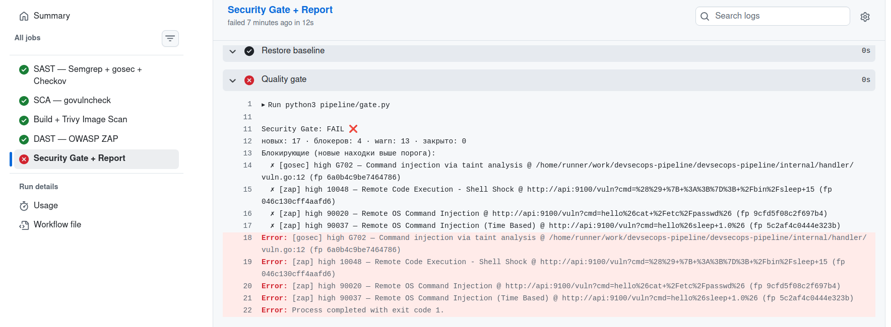
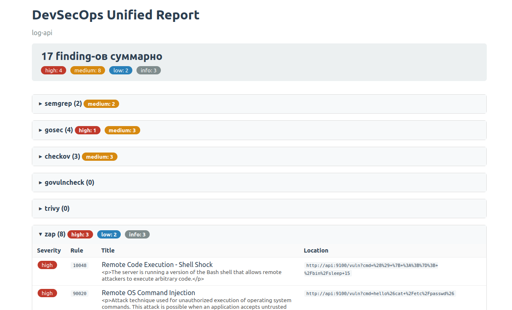
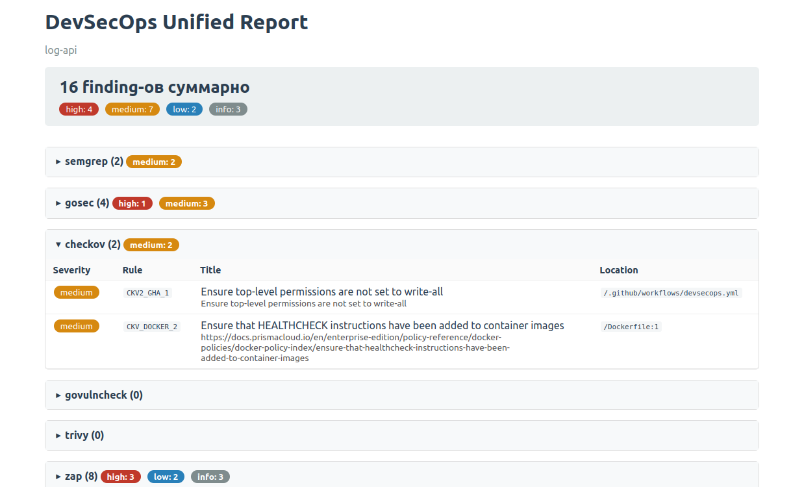
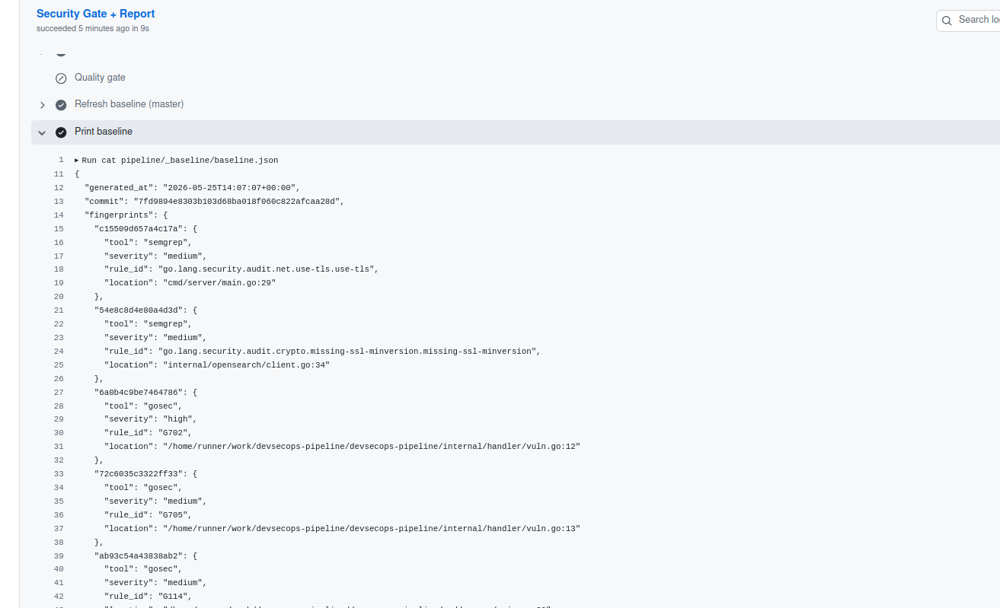
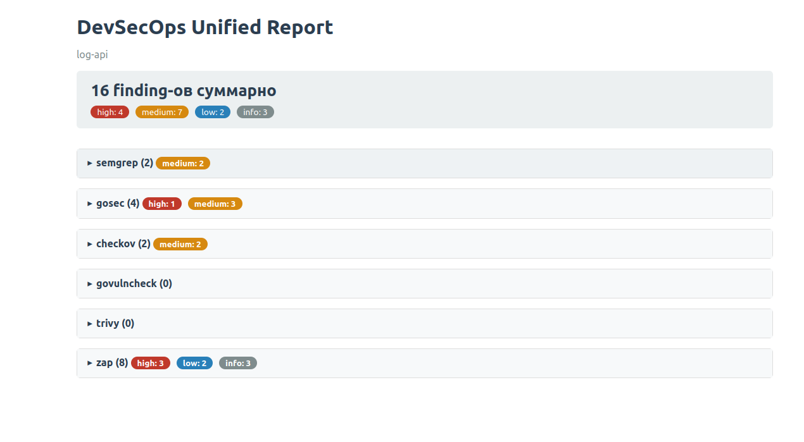
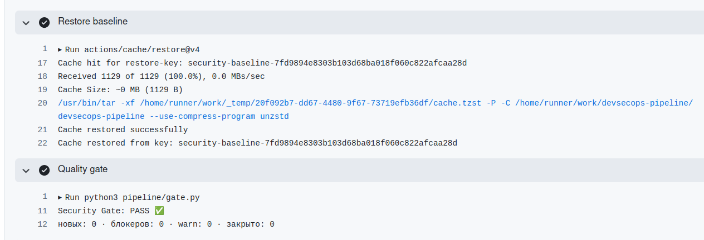

# log-api

Минимальный Go-сервис для приёма логов и их хранения в OpenSearch.

## Поток

```
client -> log-api:9100 -> OpenSearch
```

## Ручки

| Метод  | Путь     | Назначение                                            |
|--------|----------|-------------------------------------------------------|
| `POST` | `/log`   | Принять JSON-лог и проиндексировать в OpenSearch       |
| `GET`  | `/log`   | Получить все логи из OpenSearch                        |
| `GET`  | `/_ping` | Health-проба                                           |
| `GET`  | `/vuln`  | Намеренно уязвимая ручка для проверки DAST-гейта       |


## Модель лога

```go
type LogEntry struct {
    Timestamp  string                 `json:"timestamp,omitempty"`
    Level      string                 `json:"level"`
    Service    string                 `json:"service"`
    Message    string                 `json:"message"`
    Details    map[string]interface{} `json:"details,omitempty"`
    ClientIP   string                 `json:"client_ip,omitempty"`   // проставляет сервис
    ReceivedAt string                 `json:"received_at,omitempty"` // проставляет сервис
}
```

## Envs

| Переменная            | Назначение                          |
|-----------------------|-------------------------------------|
| `PORT`                | Порт сервиса (по умолчанию `9100`)  |
| `OPENSEARCH_ADDR`     | Адрес OpenSearch                    |
| `OPENSEARCH_USERNAME` | Логин                               |
| `OPENSEARCH_PASSWORD` | Пароль                              |
| `OPENSEARCH_INDEX`    | Индекс для логов                    |


# DevSecOps пайплайн

## 1. Триггер и структура

```yaml
on:
  pull_request:
    branches: [master]   # на каждый PR в master
  push:
    branches: [master]   # на merge — пересборка baseline
  workflow_dispatch:     # ручной запуск
```

Пять jobs в виде DAG:

```
sast ┐
     ├── build-and-scan ── dast ──► gate (report + quality-gate)
sca  ┘
```

```yaml
build-and-scan:
  needs: [sast, sca]      # ждём оба статических анализа
dast:
  needs: build-and-scan   # ждём собранный образ
gate:
  needs: [sast, sca, build-and-scan, dast]
  if: always()            # отчёт и решение нужны даже если что-то упало
```

- `sast` и `sca` идут параллельно — один читает код, другой зависимости.
- `build-and-scan` собирает образ на раннере (без внешнего registry) и сканит его Trivy; образ передаётся в `dast` через artifact (`docker save`/`docker load`).
- `dast` поднимает стек с этим образом и активно атакует его через ZAP.
- `gate` агрегирует все JSON в единый HTML и принимает решение pass/fail

## 2. SAST — Semgrep + gosec + Checkov

| Инструмент | Что сканит | Сильная сторона |
|---|---|---|
| Semgrep | Go-исходники | Языко-агностичный движок, кастомные правила декларативно |
| gosec | Go-исходники | Taint-анализ, специфичный для Go (G-правила) |
| Checkov | Dockerfile, GitHub Actions yaml | IaC-проверки |

### Semgrep

```yaml
semgrep \
  --config p/golang \
  --config p/secrets \
  --config pipeline/sast/semgrep-rules.yml \
  --config pipeline/sast/external/dgryski/ \
  --json --metrics=off \
  --output semgrep.json \
  cmd internal
```

| Флаг | Что делает |
|---|---|
| `--config p/golang` | Реестровый ruleset «Golang» — общие веб-уязвимости в Go |
| `--config p/secrets` | Реестровый ruleset «Secrets» — hardcoded ключи, токены, пароли |
| `--config pipeline/sast/semgrep-rules.yml` | Кастомные правила проекта |
| `--config pipeline/sast/external/dgryski/` | Внешний набор [dgryski/semgrep-go](https://github.com/dgryski/semgrep-go) |
| `--json --output semgrep.json` | Машинный формат для `merge_reports.py` |
| `--metrics=off` | Без отправки телеметрии |
| `cmd internal` | Целевой скоуп — только Go-исходники, не весь репо |

Пример сработки:

```
[medium] go.lang.security.audit.net.use-tls.use-tls
  cmd/server/main.go:29
  Found an HTTP server without TLS.
```

### gosec

Бинарь `gosec` кэшируется (`actions/cache`, ключ `gosec-Linux-v2.26.1`) — на cache-hit шаг установки пропускается.

```yaml
gosec \
  -fmt=json -out=gosec.json \
  -no-fail \
  ./cmd/... ./internal/...
```

| Флаг | Что делает |
|---|---|
| `-fmt=json -out=gosec.json` | Отчёт |
| `-no-fail` | Не возвращать non-zero при находках — решение за gate |
| `./cmd/... ./internal/...` | Скоуп: все Go-пакеты в этих директориях |

Пример сработки:

```
[HIGH] G702: Command injection via taint analysis
  internal/handler/vuln.go:12
```

### Checkov

```yaml
checkov \
  -d . \
  --framework dockerfile,github_actions \
  --quiet \
  -o json --output-file-path . || true
mv results_json.json checkov.json || true
```

| Флаг | Что делает |
|---|---|
| `-d .` | Сканить директорию рекурсивно |
| `--framework dockerfile,github_actions` | Только эти категории, а не все 30+ фреймворков |
| `--quiet` | Без прогресс-бара |
| `-o json --output-file-path .` | JSON в `results_json.json` (имя фиксированное) |
| `\|\| true` + `mv` | Гасим non-zero и переименовываем в `checkov.json` |

Пример сработки:

```
CKV_DOCKER_7: Ensure the base image uses a non latest version tag
  Dockerfile:12    FROM alpine:latest
```

## 3. SCA — govulncheck

Анализ зависимостей. Бинарь кэшируется (ключ `govulncheck-Linux-v1.3.0`).

```yaml
govulncheck -format json ./... > govulncheck.json
```

Формат — NDJSON (поток JSON-объектов): записи `osv` (метаданные CVE) и `finding` (точки вызова уязвимого кода, может быть несколько на одну CVE). Парсит `merge_reports.py::parse_govulncheck`, считая только reachable-находки (с trace).

Пример сработки:

```
GO-2026-4601: Incorrect parsing of IPv6 host literals in net/url
  src/net/url/url.go:1147
```

## 4. Build + Trivy — сборка и скан образа

Образ собирается на раннере (`push: false, load: true`), слои кэшируются через `type=gha`. Trivy сканит готовый образ — видит итоговый бинарь и слои базового alpine.

```yaml
- uses: aquasecurity/trivy-action@v0.36.0
  with:
    image-ref: log-api:devsecops-${{ github.sha }}
    format: json
    output: trivy.json
    scanners: vuln,secret,misconfig
    severity: CRITICAL,HIGH,MEDIUM,LOW
```

| Параметр | Что делает |
|---|---|
| `image-ref` | Локальный образ, собранный шагом выше |
| `scanners: vuln,secret,misconfig` | CVE в пакетах, секреты в файлах, misconfig внутри образа |
| `severity: CRITICAL,HIGH,MEDIUM,LOW` | Без `INFO/UNKNOWN`, решение по находкам — за gate |

## 5. DAST — OWASP ZAP (active API scan)

Анализ работающего приложения через HTTP. У ZAP три режима:

| Скрипт | Режим | Когда |
|---|---|---|
| `zap-baseline.py` | Только пассивный анализ | Прогон на проде/стейджинге |
| `zap-full-scan.py` | Spider crawl + активные атаки | Web-приложение с UI |
| `zap-api-scan.py` | Активные атаки по OpenAPI-спеке | Backend API без UI |

Используется `zap-api-scan.py`: эндпоинты передаются явно через OpenAPI-спеку

### Mock-инфраструктура

[pipeline/dast/docker-compose.devsecops.yml](pipeline/dast/docker-compose.devsecops.yml) поднимает сервис вместе с реальным минимальным OpenSearch. Снос — гарантированный (`down -v` в шаге с `if: always()`).

### Запуск ZAP

```yaml
docker run --rm \
  --network=devsecops_default \
  -v "$PWD/zap_wrk:/zap/wrk:rw" \
  ghcr.io/zaproxy/zaproxy:stable \
  zap-api-scan.py -t /zap/wrk/openapi.yml -f openapi -J zap.json -c zap-baseline.conf
```

| Флаг | Что делает |
|---|---|
| `--network=devsecops_default` | Контейнер ZAP в одной сети со стендом — достучится до `api:9100` по DNS |
| `-v $PWD/zap_wrk:/zap/wrk` | Рабочая папка ZAP |
| `-J zap.json` | JSON-отчёт |
| `-c zap-baseline.conf` | Переопределения FAIL/WARN/IGNORE |

Пример сработки:

```
[High] 10048 Remote Code Execution - Shell Shock
  http://api:9100/vuln?cmd=() { :;}; /bin/sleep 15
```

## 6. Quality gate

Единая точка решения pass/fail — [pipeline/gate.py](pipeline/gate.py), политика — [pipeline/policy.yml](pipeline/policy.yml). В шагах сканеров нет ни `--error`, ни `exit-code`: они только собирают JSON, гейт решает отдельно по нормализованной модели из `merge_reports.py`.

`policy.yml` — минимальная severity, с которой находка инструмента блокирует:

| Сканер | Порог |
|---|---|
| semgrep | high |
| gosec | high |
| govulncheck | high |
| trivy | critical |
| zap | high |
| checkov | never (только в отчёт) |

### Блокируются только новые находки

- **baseline** — снимок находок `master`, хранится в Actions cache.
- На **push в master** baseline пересобирается (`gate.py --update-baseline`) — текущее состояние принимается за норму.
- На **PR** гейт сравнивает находки с baseline и роняет сборку только если появилась новая находка >= порога. Известные находки идут в отчёт как warn и не блокируют.

Находка опознаётся по fingerprint `tool|rule_id|путь` (без номера строки), поэтому правки выше по файлу не делают её «новой».

## 7. Report

`gate` собирает все `*-report` артефакты в `pipeline/_reports/` (`merge-multiple: true` кладёт их плоско, имена JSON уникальны) и строит единый HTML.

[pipeline/merge_reports.py](pipeline/merge_reports.py) — без внешних зависимостей: парсер на каждый формат → нормализация в `{tool, severity, rule_id, title, location}` → HTML с `<details>`-секциями и цветовыми чипами по severity. Отсутствие JSON — не ошибка: секция помечается `missing`, упавший парсер — `parse_error`, отчёт собирается в любом случае.

## 8. Сопроводительные файлы

| Файл | Назначение |
|---|---|
| [pipeline/policy.yml](pipeline/policy.yml) | Пороги quality-gate per-tool — единственное место, где описано «что роняет сборку» |
| [pipeline/sast/semgrep-rules.yml](pipeline/sast/semgrep-rules.yml) | Кастомные правила Semgrep: SQLi через `fmt.Sprintf`, command injection через конкатенацию |
| [pipeline/sast/external/dgryski/](pipeline/sast/external/dgryski/) | Внешний набор правил для Go |
| [pipeline/dast/openapi.yml](pipeline/dast/openapi.yml) | Спека эндпоинтов — цели для активного скана ZAP |
| [pipeline/dast/zap-baseline.conf](pipeline/dast/zap-baseline.conf) | Переопределения ZAP: какие правила игнорировать (нерелевантные backend-API) |
| [pipeline/dast/docker-compose.devsecops.yml](pipeline/dast/docker-compose.devsecops.yml) | Эфемерный стенд для DAST (сервис + OpenSearch) |

## 9. Локальный запуск

| Команда | Что делает |
|---|---|
| `./pipeline/sast/run.sh` | Semgrep + gosec + Checkov |
| `./pipeline/sca/run.sh` | govulncheck |
| `./pipeline/build-and-scan/run.sh` | Build + Trivy |
| `./pipeline/dast/run.sh` | DAST (поднимает compose, гонит ZAP, сносит стек) |
| `python3 pipeline/merge_reports.py` | HTML-агрегация из `pipeline/_reports/*.json` |
| `python3 pipeline/gate.py` | Прогнать quality-gate по `policy.yml` |

JSON-отчёты складываются в `pipeline/_reports/` (gitignored).

## 10. Запуски по шагам
Все скрины и сохраненные репорты в `static/img/` и `static/reports/`

1. пулл реквест ветки demo->master

Сработка quality-gate


Отчет


2. коммит -> opened pr demo->master. Фикс latest тега Checkov

CKV_DOCKER_7 пропал из сканов Checkov


3. Принятие открытого pr demo->master

Создание baseline для дальнейшего игнорирования гейтом старых сработок. То есть сработки запушенные в master считаются фолзой, которую намеренно игнорируем в дальнейшей разработке



4. коммит после установившегося baseline-a

Был открыт новый pr new-feature->master с добавлением нового поля в модель `LogEntry`

Так как пуш в мастер установил baseline в ш. 3, то старые сработки, не решенные в new-feature попали в игнор при новом pull request и quality gate успешно прошел. Тем не менее в отчете старые ошибки все равно показаны

Отчет


Гейт
